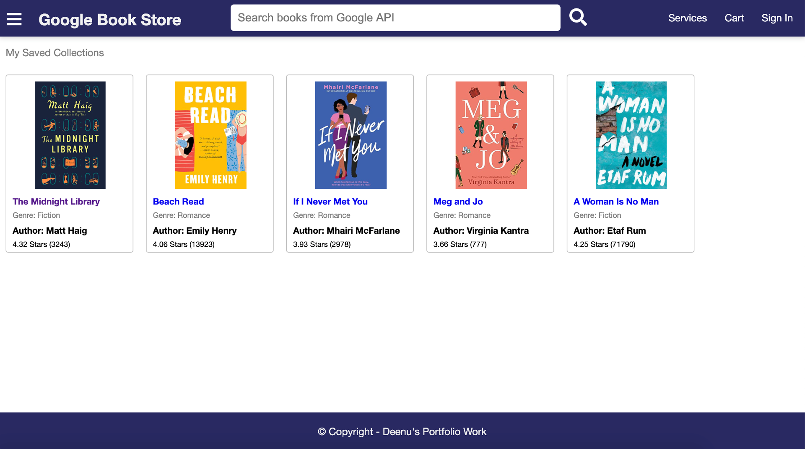

# Google Books Store - MERN full stack app
Google Books Store is a react-based full stack app developed for users to discover books and bookmark in favorite collections by Genre so that users can purchase later. This app is developed on platform of MERN stack i.e. REACT, Node, Express and MongoDB.

Hosted url: https://uoft-google-book-store.herokuapp.com/

## User Story: 
As a user, I want to discover books from Google store and bookmark them into my collections so that I can purchase later. 
As a user, I want to find the saved books in my collection by Genre.

## USP:

Userfriendly search and easy to organize into collections 

## Demo

